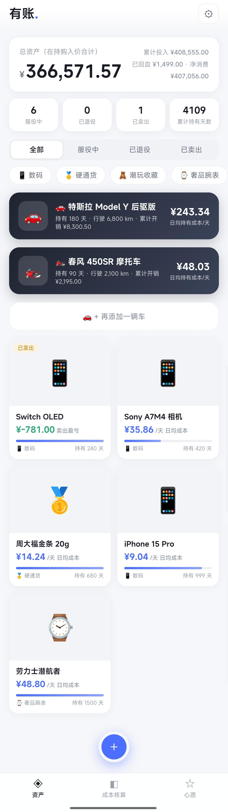
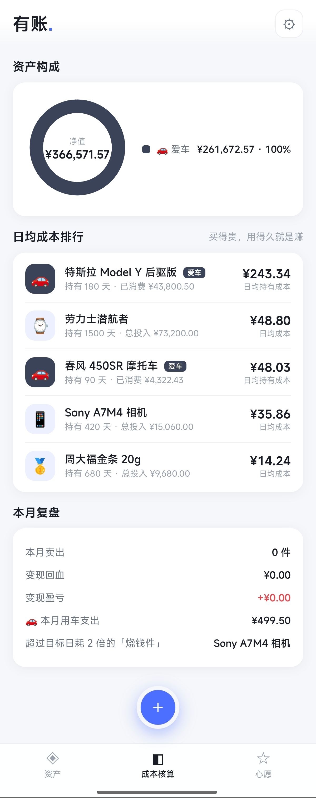
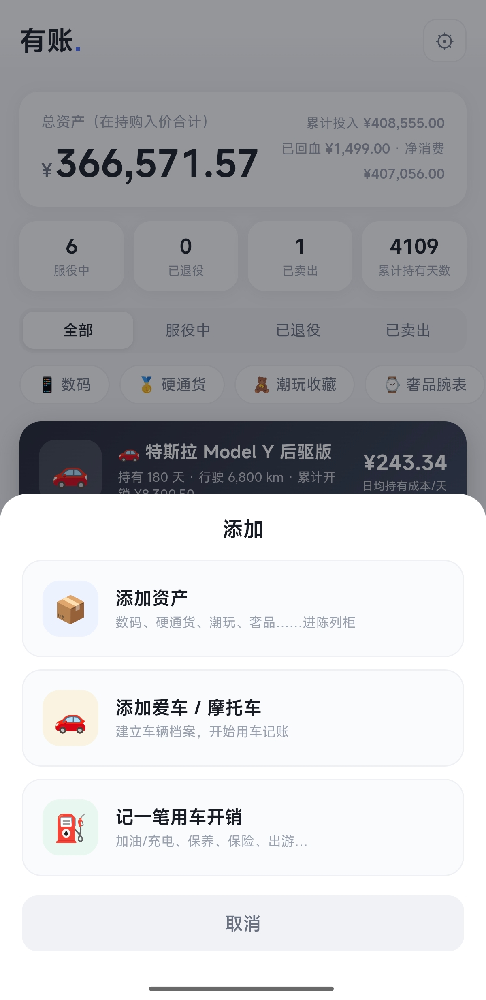
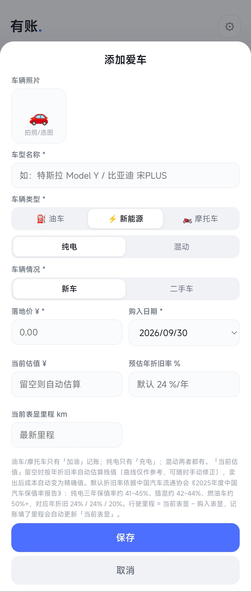
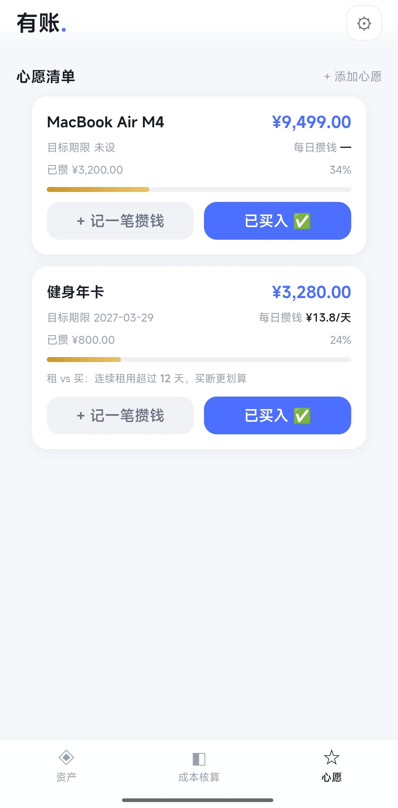

# OpenLedger（有账）

个人资产管理工具，日均持有成本可视化。本地优先，把你的数码设备、硬通货、收藏品、爱车……全部建成一份「会算账」的资产清单：每一件东西每天花你多少钱，一目了然。

> 一切可以变现的都是资产。

## 快速开始

### 方式一：电脑直接使用（零安装）

下载 [`app/index.html`](app/index.html)，双击用浏览器打开即可，数据保存在本机。

### 方式二：安卓 APK

前往 [Releases](../../releases) 下载最新版 APK，安装即用。数据保存在应用内，同样不上传。

### 方式三：从源码运行

```bash
git clone https://github.com/FenrisulfrPro/open-ledger.git
# 应用本体是纯静态单文件：app/index.html，无任何构建依赖
```

### 自行打包 APK

```bash
npm install
npx cap sync android        # 同步 web 资源到安卓工程
cd android && ./gradlew assembleRelease
```

或直接推送 `v*` 标签，GitHub Actions 会自动构建并发布到 Release。

## 界面一览

### 资产总览

首页陈列柜：总资产、累计投入 / 已回血 / 净消费、服役中 / 已退役 / 已卖出状态统计，按品类筛选；爱车卡片置顶展示日均持有成本；下方两列陈列柜网格，每件资产直观显示日均成本与持有天数。



### 资产构成与分析

成本核算页：资产构成环形图（含爱车）、日均成本排行榜（谁最「烧钱」一目了然）、本月复盘（变现回血 / 盈亏、本月用车支出、超目标日耗的「烧钱件」提醒）。



### 添加资产

统一添加面板，支持录入数码、硬通货、潮玩收藏、奢品腕表等品类：购入价格、购入日期、附加开销、目标日耗回本线、存放位置与标签。



### 添加爱车

车辆档案支持油车 / 新能源（纯电·混动）/ 摩托车三类动力，新车 / 二手车分情况录入里程；估值可留空由折旧曲线自动估算，也可手动修正。



### 心愿清单

目标价 + 期限自动测算每日攒钱额度，记一笔攒钱打卡、进度条、已买入结算，并提供「租 vs 买」多久回本的对比参考。



## 特性

- **万物资产化**：拍照录入资产（数码 / 硬通货 / 潮玩收藏 / 奢品腕表 / 虚拟资产），记录买入价与附加开销
- **持有天数摊销**：普通资产日均成本 =（买入价 + 附加开销）÷ 持有天数，随时间自然下降，支持设定回本目标
- **爱车记账**：支持多辆车（油车 / 纯电 / 混动 / 摩托车），充电 / 加油 / 保养维修 / 保险 / 出游 / 改装全类型账本；双轨成本模型（日均现金开销 + 日均折旧），每公里综合成本与能耗成本
- **生命周期管理**：服役中 / 已退役 / 已卖出，卖出自动结算盈亏与真实成本
- **心愿清单**：目标价 + 期限自动算每日攒钱额度，租 vs 买对比
- **数据本地化**：所有数据仅存于本机，不上传任何服务器；支持 JSON 导出备份

## 技术栈

- 应用本体：原生 HTML / CSS / JavaScript 单文件，零依赖、零网络请求
- 安卓打包：[Capacitor](https://capacitorjs.com/) WebView 壳
- CI/CD：GitHub Actions（打 tag 自动出签名 APK）

## 数据与隐私

- 所有数据（含照片）仅存储在设备本地（localStorage），无后端、无埋点、无追踪
- 「设置 → 导出数据」可导出完整 JSON 备份，换设备时导入即可迁移
- 清除浏览器/应用数据会清空账本，请定期导出备份

## License

[MIT](LICENSE)
